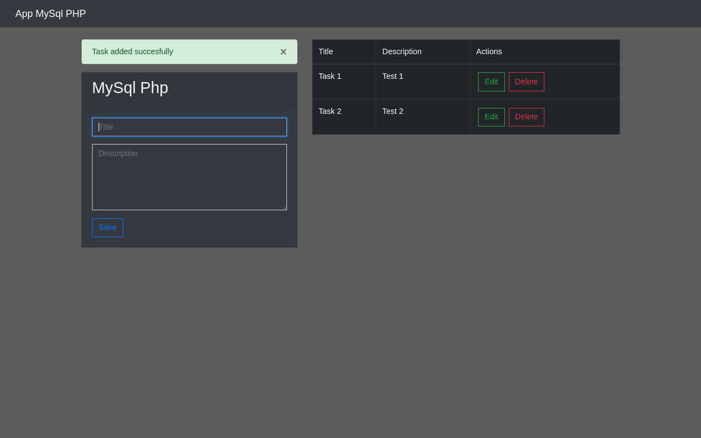

# MySql Php Tasks
_Estas instrucciones te permitirán obtener una copia del proyecto en funcionamiento en tu máquina local para propósitos de desarrollo y pruebas_



### Pre-requisitos
Cosas que nesecitas para obtener el projecto en funcionamiento

* PHP
* Apache
* MySql
* Git --Solo si se va a clonar el repositorio

### Instalacion
_Serie de pasos para ejecutar en local y en entorno de desarrollo_

* Abrir consola de comandos
* Ir la carpeta donde se encuetra el servidor de Apache

#### Clonar o descargar el Zip
```
git clone https://github.com/denis360/mysql-php-tasks.git
```
```
cd mysql-php-tasks
```

#### Iniciar Apache y MySql
* En mi caso para iniciar Apache en linux es:
```
sudo systemctl enable httpd
```
```
sudo systemctl start httpd
```
* Inicia MySql
```
sudo systemctl start mysqld.service
```
```
mysql -u root -p
```

### Crear la base de datos
```
CREATE DATABASE tasks;
```

* Crear la tabla de tareas
```
CREATE TABLE tasks(
  id SERIAL PRIMARY KEY,
  name VARCHAR(50),
  description TEXT
);
```

### Cambios
* Cambiar la contraceña de conexion a MySql en el archivo /controllers/database.php
```
$password="[contraceña]"
```

#### Iniciar en entorno de desarrollo
* Ir a tu navegador en la ruta https://localhost:80/["Ruta de la carpeta"]

